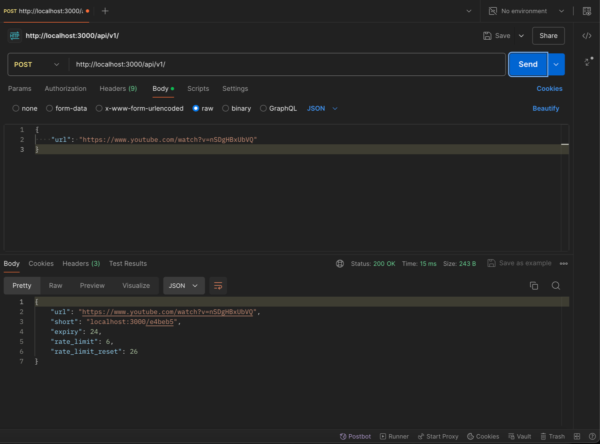
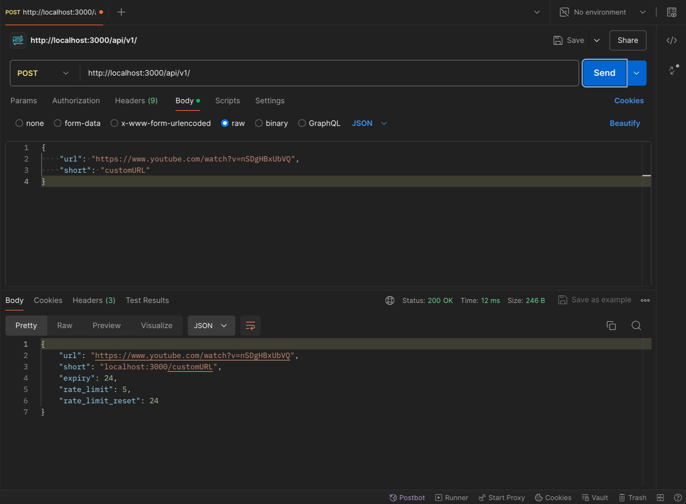
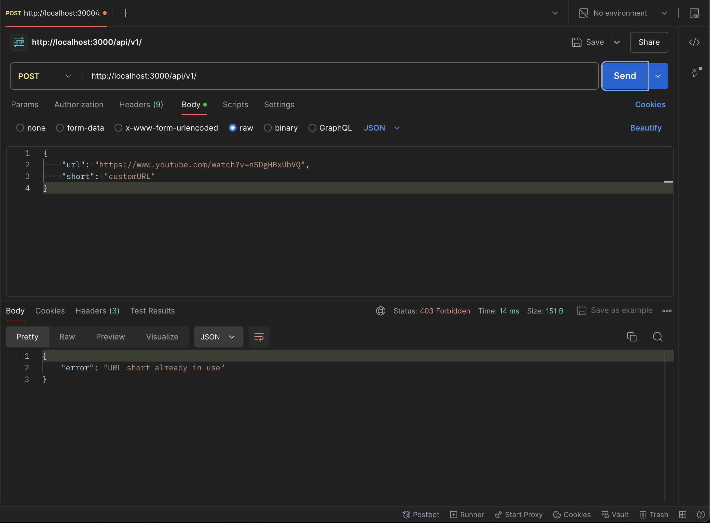
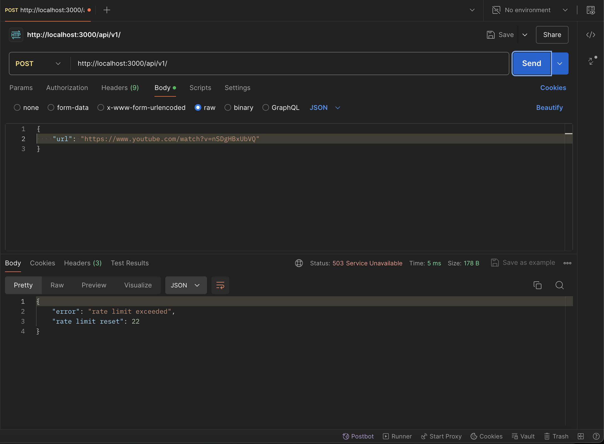

# URL Shortener

### Description:

URL shortener is an API service which requests URL from the user to shorten and returns shorten url with random ID or the custom ID entered by the user. Redis database is used to store the URL entered and corresponding shortened URL. The user has a quota of 10 requests to be passed in duration of 30 minutes. 

### Installation:

- clone the repository

```bash
git clone https://github.com/thesilentline/shorten-url-project.git
```

- to build and run the docker container

```bash
docker-compose up -d 
```

### Screenshot:









### Tech Stack:

Go | Fiber | Redis | Docker